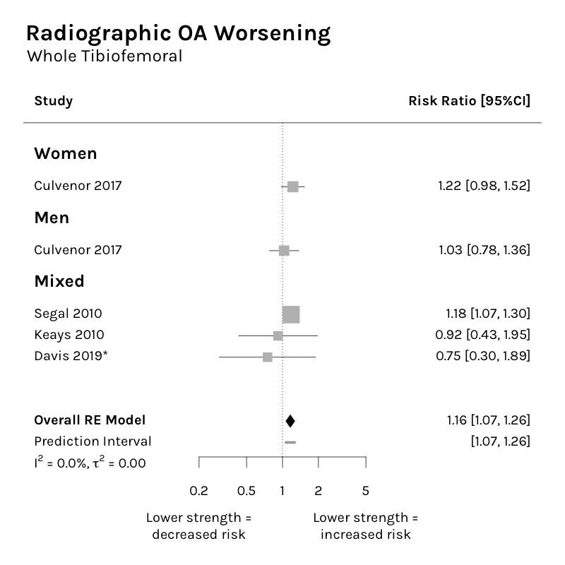
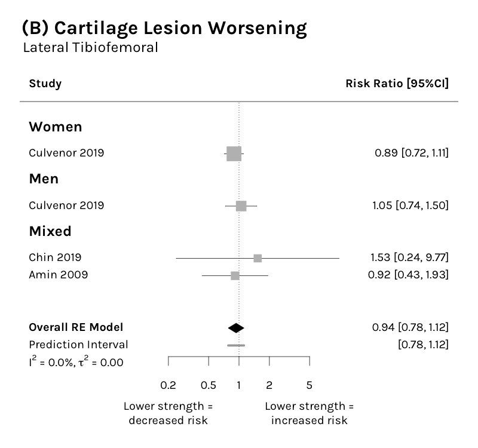
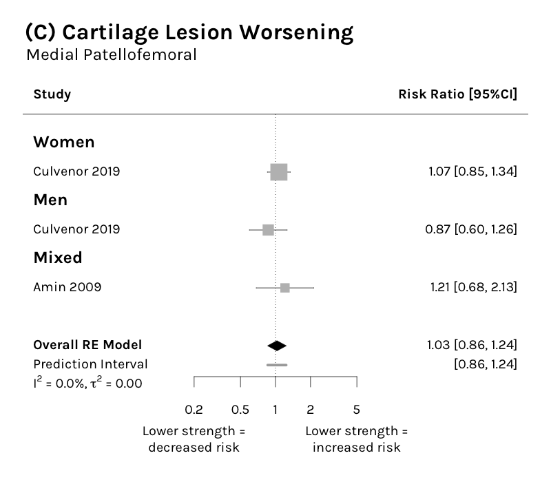
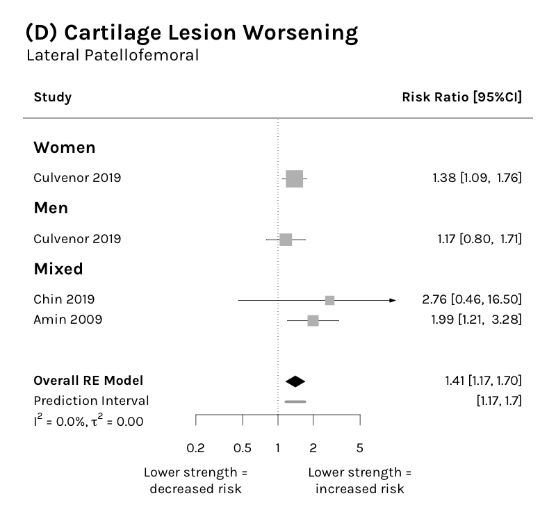
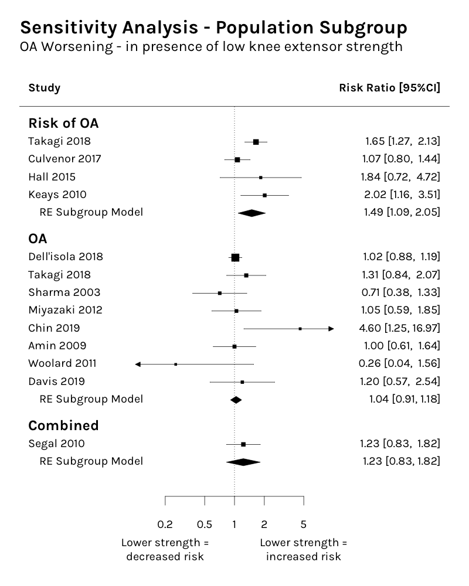

```{r setup, include=FALSE}


knitr::opts_chunk$set(echo = TRUE)
library(tidyverse)
library(kableExtra)
library(reactable)

quadsoafulldata <- read_csv("~/r/quadsoa_sr/output/tables/Meta Analysis Full Results.csv") %>%
  mutate(across(where(is.numeric), ~round(.x, 3)))

quadsoadata <- quadsoafulldata %>%
  select(1:4, nobs, estimate, std.error, statistic, p.value, conf.low, conf.high, i.squared, pi.lb, pi.ub)

quadsoatest <- quadsoadata %>%
  group_by(outcome, analysis_group, muscle) %>%
  nest

quadsoatable2 <- quadsoafulldata %>%
  select(outcome:muscle, nobs:conf.high, pi.lb, pi.ub, i.squared:AICc)

```

## Results from all meta-analyses subgroups conducted

For these data individual meta-analyses are split by sex (mixed, men or women) as well as an overall estimate (all sex together)

```{r table, echo = FALSE}


#reactable(quadsoadata, filterable = TRUE, minRows = 40, defaultPageSize	= 40, fullWidth = TRUE)

quadsoatable <- quadsoadata %>%
  group_by(outcome, analysis_group, muscle) %>%
  mutate(analysis_no = factor(paste(outcome, analysis_group, muscle))) %>%
  mutate(analysis_no = as.numeric(analysis_no)) %>% 
  select(analysis_no, everything()) %>%
  ungroup() 
  
quadsoanest <- quadsoatable %>%  
  group_by(analysis_no) %>%
  nest(data = -c(analysis_no, outcome, analysis_group, muscle)) %>%
  select(-data)

quadsoaall <- quadsoadata %>%
  group_by(outcome, analysis_group, muscle) %>%
  mutate(analysis_no = factor(paste(outcome, analysis_group, muscle))) %>%
  mutate(analysis_no = as.numeric(analysis_no)) %>% 
  select(analysis_no, everything()) %>%
  ungroup() %>%
  select(-c(outcome, analysis_group, muscle))

reactable(quadsoanest, defaultPageSize	= 12, details = function(index){
  metadata <- quadsoaall[quadsoaall$analysis_no == quadsoanest$analysis_no[index], ]
  htmltools::div(style = "padding: 1rem",
  reactable(metadata, outlined = TRUE)
  )
})
```

## Radiographic Worsening

### Quads - Whole TF
{width=70%}

```{r, echo = FALSE}
quadsoatable2 %>%
  filter(outcome == "worsening JSN/OA", 
         muscle == "quad", 
         analysis_group == "whole tf") %>%
  select(-c(outcome, muscle, analysis_group)) %>%
  kbl() %>% kable_styling(position = "left", full_width = FALSE)
```

### Quads - Whole PF
{width=70%}

```{r, echo = FALSE}
quadsoatable2 %>%
  filter(outcome == "worsening JSN/OA", 
         muscle == "quad", 
         analysis_group == "whole pf") %>%
  select(-c(outcome, muscle, analysis_group)) %>%
  kbl() %>% kable_styling(position = "left", full_width = FALSE)
```

### Hamstring - Whole TF
{width=70%}

```{r, echo = FALSE}
quadsoatable2 %>%
  filter(outcome == "worsening JSN/OA", 
         muscle == "hs", 
         analysis_group == "whole tf") %>%
  select(-c(outcome, muscle, analysis_group)) %>%
  kbl() %>% kable_styling(position = "left", full_width = FALSE)
```

### Hamstring - Whole PF
```{r, echo = FALSE}
quadsoatable2 %>%
  filter(outcome == "worsening JSN/OA", 
         muscle == "hs", 
         analysis_group == "whole pf") %>%
  select(-c(outcome, muscle, analysis_group)) %>%
  kbl() %>% kable_styling(position = "left", full_width = FALSE)
```

---

## Joint Space Narrowing

### Quads - Medial TF
{width=70%}

```{r, echo = FALSE}
quadsoatable2 %>%
  filter(outcome == "quantitative JSN", 
         muscle == "quad", 
         analysis_group == "medial tf") %>%
  select(-c(outcome, muscle, analysis_group)) %>%
  kbl() %>% kable_styling(position = "left", full_width = FALSE)
```

### Quads - Lateral TF
One study - Dell'Isola 2018
```{r, echo = FALSE}
quadsoatable2 %>%
  filter(outcome == "quantitative JSN", 
         muscle == "quad", 
         analysis_group == "lateral tf") %>%
  select(-c(outcome, muscle, analysis_group)) %>%
  kbl() %>% kable_styling(position = "left", full_width = FALSE)
```

---

## Cartilage Thinning

### Quad - Medial TF
{width=70%}

```{r, echo = FALSE}
quadsoatable2 %>%
  filter(outcome == "quantitative cartilage progression", 
         muscle == "quad", 
         analysis_group == "medial tf") %>%
  select(-c(outcome, muscle, analysis_group)) %>%
  kbl() %>% kable_styling(position = "left", full_width = FALSE)
```

### Hamstring - Medial TF
1 study (Dannhauer 2014)
```{r, echo = FALSE}
quadsoatable2 %>%
  filter(outcome == "quantitative cartilage progression", 
         muscle == "hs", 
         analysis_group == "medial tf") %>%
  select(-c(outcome, muscle, analysis_group)) %>%
  filter(sex == "mixed") %>%
  kbl() %>% kable_styling(position = "left", full_width = FALSE)
```

---

## Cartilage Lesion Worsening

### Quad - Medial TF
{width=70%}

```{r, echo = FALSE}
quadsoatable2 %>%
  filter(outcome == "semi quantitative cartilage progression", 
         muscle == "quad", 
         analysis_group == "medial tf") %>%
  select(-c(outcome, muscle, analysis_group)) %>%
  kbl() %>% kable_styling(position = "left", full_width = FALSE)
```

### Quad - Lateral TF
{width=70%}

```{r, echo = FALSE}
quadsoatable2 %>%
  filter(outcome == "semi quantitative cartilage progression", 
         muscle == "quad", 
         analysis_group == "lateral tf") %>%
  select(-c(outcome, muscle, analysis_group)) %>%
  kbl() %>% kable_styling(position = "left", full_width = FALSE)
```

### Quad - Medial PF
{width=70%}

```{r, echo = FALSE}
quadsoatable2 %>%
  filter(outcome == "semi quantitative cartilage progression", 
         muscle == "quad", 
         analysis_group == "medial pf") %>%
  select(-c(outcome, muscle, analysis_group)) %>%
  kbl() %>% kable_styling(position = "left", full_width = FALSE)
```

### Quad - Lateral PF
{width=70%}
```{r, echo = FALSE}
quadsoatable2 %>%
  filter(outcome == "semi quantitative cartilage progression", 
         muscle == "quad", 
         analysis_group == "lateral pf") %>%
  select(-c(outcome, muscle, analysis_group)) %>%
  kbl() %>% kable_styling(position = "left", full_width = FALSE)
```

---

## Overall Summary


---

## Sensitivity Analyses - Population Subgroup

For Worsening JSN/OA compared the 3 population subgroups in the review:

* with OA
* at risk of OA
* with or at risk of OA

Results:

{width=70%}
```{r, echo = FALSE}

read.csv("~/r/quadsoa_sr/output/tables/Population Subgroup Sensitivity Analysis.csv") %>%
  select(-c(outcome, muscle, analysis_group, term, type)) %>%
  mutate(across(where(is.numeric), ~round(.x, 3))) %>%
  kbl() %>% kable_styling(position = "left", full_width = FALSE)

```

## RoB Plot


